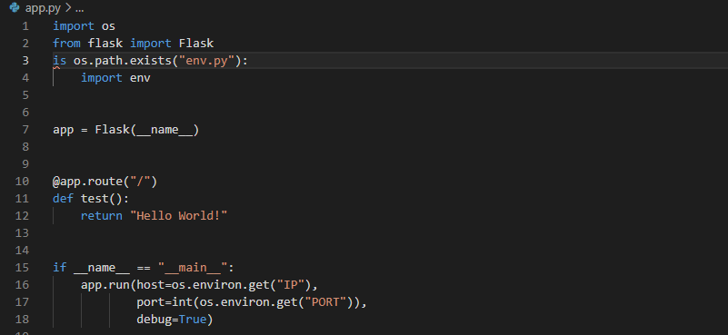

# Linton's Lights: Memory Game

#### Code Institute Full Stack Development Dipoloma: Milestone Project 3 - Backend Development Milestone Project 
##### Created by William Donovan

[link to Project]()

# Table of Contents 

1. [UX Development](#uxdev)
   - Project Manifesto and Aim
   - User Goals
   - Designer Goals
   - Developer and Site Owner goals
   - User Stories 
   - Design Principles 
     * Fonts
     * Icons
     * Colours
   - Sitemap and Wireframes
   - Features and Future Implementations 
2. [Testing](#testing)
   - Game Testing / Life Cycle
   - HTML and CSS checks using WC3 
   - User Testing
   - Peer Code Review
3. [Bugs and De-bugging](#bugs)
   - Known bugs
   - Solutions 
4. [Technologies Used](#languages)
   - Languages Utilised
   - Online Material
   - Tools and Databases Used
5. [Project Deployment](#deployment)
   - Process of Deployment
   - How to create local version
6. [References](#references)
7. [Acknowledgements](#acknowledge)

# UX Development 

## Project Manifesto and Aim 
"The UK video games market hit a record £7bn last year as lockdown fuelled an unprecedented boom in the popularity of mobile games, consoles and virtual reality headsets." A statement quoted from the Guardian roughly 6 months ago became the basis for Escro. With several major distribution services already available for PC and Console, I thought of creating an application, focusing around databse integration, for the new influx of gamer to post about and discover new Indie Games.  

The use of 'bumping' and 'commenting' will mirror the Reddit mechanic to hopefully create a community driven network. By storing all the data on MongoDB, the application can allow for searching, genre filtering, promotion of top posts and the ability to edit, delete and create posts within the app. The overall aim is tp utilise this new user base and generate coverage for new indpendent games.

## User Goals
The central target audience for this game is anyone with a passion for games but mainly between the ages of 14-35.

User Goals:
- Create an account
- Create, Read, Update and Delete content
- Publish posts about a game
- Comment on and 'bump' other user posts
- Search through the library of games with or without an account
- Check prices, platform and release availability

## Designer Goals
Hopefully the app will be useful for the games designers as well as the gamer.

Designer Goals:
- Create an account (possibly with designer privileges)
- Post about new releases and games not for release yet
- Users can search for production team and see what other releases they have
- Define a genre
- Simple but effective UX sheds some light on artwork and the games aesthetic 

## Developer and Site Owner Goals
Encourage new bedroom gamers to expand their horizons and be a part of the gaming community to help grow the space. 

Developer Goals:
- Create a functioning app for users that uses MongoDB to collect data. With this data, the Developer could understand gaming trends and other valuable knowledge about the industry.

# User Stories

# Design Principles

## Fonts

   
## Icons

## Colours

### Space

### Buttons

# Sitemap / Wireframes

# Features / Future Implementations

--------------------

# Testing 

## Setting up Flask environment
- To initialise my Flask environment, app.py and env.py were created. Inside my env.py file, all the default environment variables needed to connect to Flask and the database "escro_games" on MongoDB. Below is a screenshot of my app.py initialisation, when run for the first time, it was unsuccessful due to a syntax error...

After changing "is" to "if", my test function produced "Hello World!" on the test site. Flask is now successfully initialised and working. 

## Game Testing / Life Cycle

## HTML and CSS checks

## User Testing 

# Bugs / De-Bugging 

# Technologies Used 

1. [jQuery](https://jquery.com/)
3. [CSS 4](https://www.w3schools.com/w3css/)
5. [HTML 5](https://en.wikipedia.org/wiki/HTML5)
6. [JavaScript](https://www.javascript.com/)
7. [Dev Tools](http://ami.responsivedesign.is/)

# Project Deployment 

# References 

# Acknowledgements 

